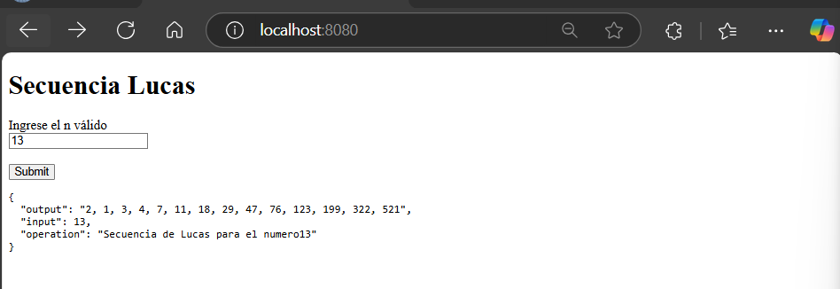

## Parcial Arep Segundo Tercio

## Entregado por:

* Andrés Felipe Rodríguez Chaparro

## Enunciado
La secuencia de Lucas es una secuencia de enteros que lleva el nombre del matemático François Édouard Anatole Lucas (1842-1891), 
quien estudió tanto esa secuencia como su relación con la secuencia de Fibonacci.

## Secuencia de Lucas:
La secuencia de Lucas se calcula de la siguiente manera :

* L(0)=2
* L(1)=1
* L(n)=L(n−1)+L(n−2), para un n≥2

## Desarrollo 

La aquitectura se basa en un proxy, y un servicio en dos instancias EC2 separadas, el proxy, sirve como puente de comunicación para delagar la logica al servicio 

## Prueba de funcionamiento En local

## El despliegue 

Creamos dos instancias EC2, una llamada proxy y la otra Lucas

Nos conectamos 

para cargar la aplicación, opte por utilizar el archivo Jar

Se realiza el cargue del archivo con este comando 

para la instancia proxy

´´´
scp -i "C:\Users\andres.rchaparro\Downloads\pro.pem" "C:\Users\andres.rchaparro\Downloads\demo\demo\target\demo-0.0.1-SNAPSHOT.jar" ec2-user@44.208.28.136:/home/ec2-user
´´´

para la instancia lucas

´´´
scp -i "C:\Users\andres.rchaparro\Downloads\lucas.pem" "C:\Users\andres.rchaparro\Downloads\demo\demo\target\demo-0.0.1-SNAPSHOT.jar" ec2-user@44.210.112.44:/home/ec2-user
´´´

verificamos la exitencia del archivo con el comando 

´´´
ls -lah
´´´

Corremos ambas instancias con el comando

´´´
java -jar demo-0.0.1-SNAPSHOT.jar (para la instancia proxy)
java -jar demo-0.0.1-SNAPSHOT.jar --server.port=8081 (para la instancia Lucas)
´´´

NOTA: Tuve problemas con el grupo de seguridad y el cliente Html no carga al acceder a la Ip de la instancia en el navegador

